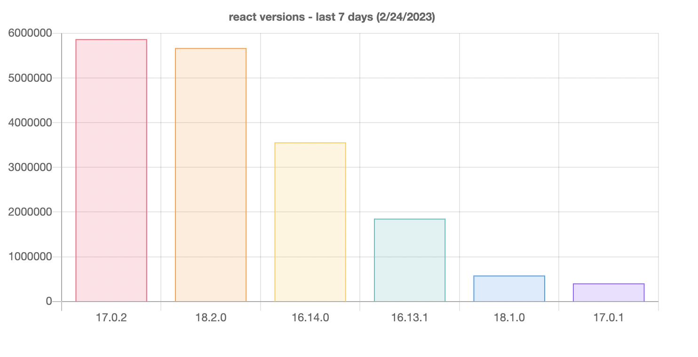

# NPM Versions

## Instructions

 * go to: https://www.npmjs.com/package/react?activeTab=versions
 * open console and copy `window.__context__` object
 * save to json file
 * replace this line `parse("./example.json");` in stats.js
 * open terminal
 * run `npm run stats`
 * open index.html
 